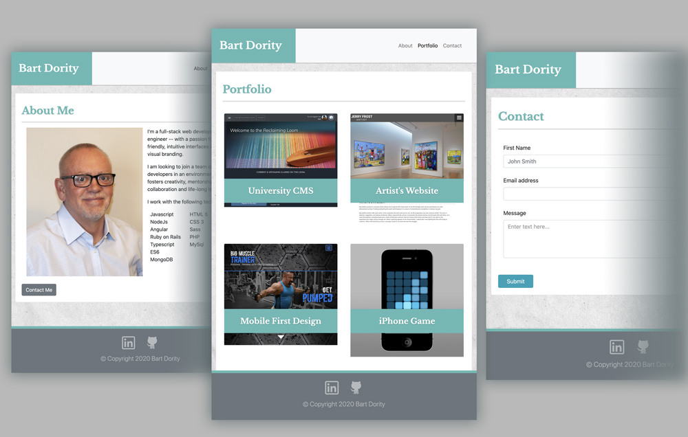

# responsive-portfolio

This website generates a responsive layout, using Bootstrap's
popular front-end open source toolkit 

## There are three pages :
- About : This is the homepage.  It contains basic information about the author. 
- Portfolio : This section displays the project work, the author has worked on.
- Contact : This section has a contact form.

## Technologies Used
- HTML - used to create elements on the DOM
- Custom CSS styles - provides a few custom enhancements to visual styling
- Bootstrap CDN - responsive design and styling 
- Git - version control system to track changes to source code
- GitHub - hosts repository that can be deployed to GitHub Pages

